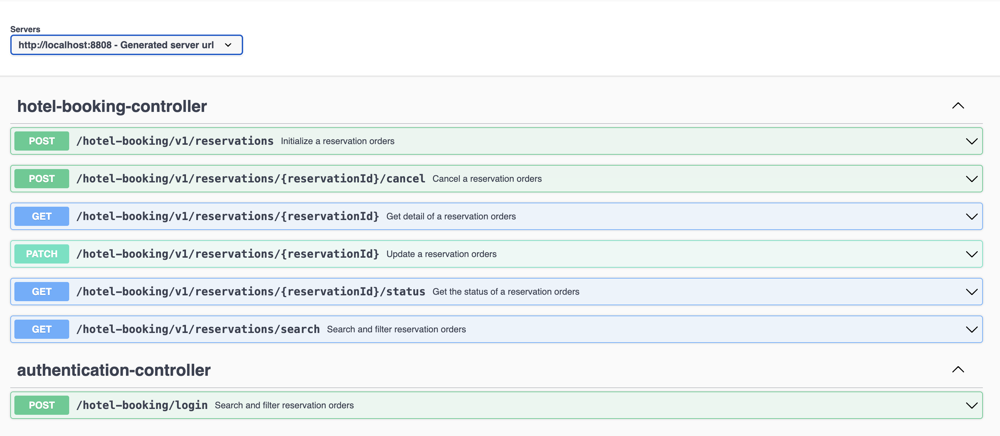

# Hotel Booking REST API

## Overview

The Hotel Booking REST API is a Spring Boot and Gradle-based web service that manages hotel reservations. The API is documented using Springdoc OpenAPI.

## Features

- CRUD operations for Hotel reservation
- Secure API with authentication.

## Getting Started

### Prerequisites

- Java JDK
- [Gradle](https://gradle.org/install/)
- Database [MySQL](https://www.mysql.com/)

### Installation

1. **Clone the repository:**

   ```bash
   git clone https://github.com/HoangMac/hotelbooking.git

2. **Navigate to the project directory:**

    ```bash
    cd hotelbooking

3. **Build the project using Gradle:**

    ```bash
    ./gradlew build

4. **Run the application:**
   
   Create database `hotel_booking_db` in your database, then :

    ```bash
   ./gradlew bootRun
   ```
   Or with your datasource configuration 
    ```bash
   ./gradlew bootRun --args='--DB_URL=localhost --DB_PORT=3306 --DB_USER=root --DB_PWD=root'
   ```

The application will start on http://localhost:8808.


## Usage
### Authentication
Include a valid authentication token in the request header to access protected endpoints.

### API Documentation
Access the API documentation by navigating to:

http://localhost:8808/swagger-ui.html




### Sample Requests
Import the collection to your Postman for testing :

[Hotel Booking v1.postman_collection.json](https://github.com/HoangMac/hotelbooking/blob/main/Hotel%20Booking%20v1.postman_collection.json)


## Documentations
### Process Flow


### Sequence Diagram


### Infrastructure design


